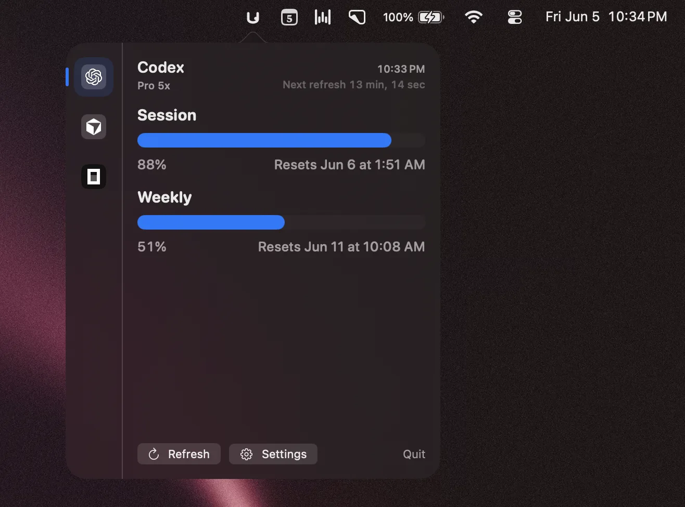

# ubos



Native macOS menu bar usage tracking for AI coding subscriptions.

`ubos` gives developers one compact popover for checking Codex, Cursor, and OpenCode Go usage without opening multiple dashboards. It reads local provider state, refreshes automatically, and presents quota, credits, spend, reset timing, and status in a polished SwiftUI/AppKit menu bar experience.

This is a personal macOS app informed by an OpenUsage-style feature parity study in [`docs/feature-parity.html`](docs/feature-parity.html). The provider behavior and quota logic intentionally focus on the subset useful for personal day-to-day usage rather than recreating OpenUsage as a full cross-platform product.

## Install

Download the latest notarized DMG from [GitHub Releases](https://github.com/noelrohi/ubos/releases).

Or build from source:

```bash
git clone https://github.com/noelrohi/ubos.git
cd ubos
xcodebuild build -project "ubos.xcodeproj" -scheme "ubos" -destination "platform=macOS"
```

## Usage

1. Sign in to the AI tools you want to track using their normal desktop or CLI flows.
2. Open `ubos`.
3. Click the menu bar icon to view current usage.
4. Use Settings to tune refresh cadence and app behavior.

The popover shows provider cards with compact metrics, progress bars, status dots, skeleton loading states, last refresh time, and next refresh countdown.

## What it tracks

- **Codex**: usage from local Codex auth and the ChatGPT usage endpoint, following the OpenUsage-documented OAuth and usage endpoint behavior
- **Cursor**: plan usage, auto usage, credits, on-demand spend, and request usage using the OpenUsage-style fallback model
- **OpenCode Go**: session, weekly, and monthly usage from the local OpenCode SQLite database, mirrored against fixed personal Go limits

Provider data is read locally from:

- OpenCode Go: `~/.local/share/opencode/`
- Codex: `~/.codex/` and `~/.config/codex/`
- Cursor: `~/Library/Application Support/Cursor/User/globalStorage/`

## What it adds

- Personal, native macOS interpretation of the OpenUsage usage model
- Native macOS menu bar app built with SwiftUI and AppKit
- Compact multi-provider usage dashboard
- Automatic refresh with visible refresh timing
- Local-first provider integrations
- Sandboxed app configuration with scoped provider directory access
- Native macOS settings window
- Sparkle auto-update support via signed appcast releases
- Developer ID signed, notarized, stapled DMG distribution

## Flow

```text
launch ubos
  -> create menu bar status item
  -> read provider auth and local usage state
  -> fetch/compute usage snapshots
  -> render provider cards in an NSPopover-hosted SwiftUI view
  -> refresh automatically on the configured interval
  -> surface updates through Sparkle when releases are published
```

## Architecture

`ubos` is a native SwiftUI macOS application with AppKit integration where macOS requires it.

- `NSStatusItem` owns the menu bar presence
- `NSPopover` hosts the SwiftUI usage dashboard
- SwiftUI powers provider cards, metrics, loading states, and settings
- Provider implementations live behind isolated `*UsageProvider.swift` files
- The app runs as an accessory app so it stays out of the Dock and app switcher

## Requirements

- macOS 26.2 or newer
- Xcode with the macOS 26.2 SDK for local development
- Local sign-ins for the providers you want to track

## Development

List schemes:

```bash
xcodebuild -list -project "ubos.xcodeproj"
```

Build the app:

```bash
xcodebuild build -project "ubos.xcodeproj" -scheme "ubos" -destination "platform=macOS"
```

Run unit tests:

```bash
xcodebuild test -project "ubos.xcodeproj" -scheme "ubos" -destination "platform=macOS" -only-testing:ubosTests
```

## Project structure

- `ubos/ubosApp.swift`: app entrypoint and menu bar lifecycle wiring
- `ubos/ContentView.swift`: root popover dashboard UI
- `ubos/SettingsView.swift`: native settings interface
- `ubos/*UsageProvider.swift`: provider integrations and usage parsing
- `appcast.xml`: Sparkle update feed
- `release.json`: release automation configuration

Xcode file-system synchronized groups are enabled, so files added under `ubos/`, `ubosTests/`, and `ubosUITests/` are picked up by folder membership.

## Notes

`ubos` is built for personal use. It borrows the practical provider logic mapped in `docs/feature-parity.html`, but it does not embed the OpenUsage plugin runtime, proxy system, or full product surface. Native Swift adapters are smaller, easier to debug, and better aligned with macOS sandbox and Keychain behavior for this scope.

## Release behavior

Releases are packaged as Developer ID signed, notarized, stapled DMGs and published through GitHub Releases. Sparkle update metadata is maintained in `appcast.xml` with EdDSA signatures generated from the final stapled DMG bytes.

## License

MIT
